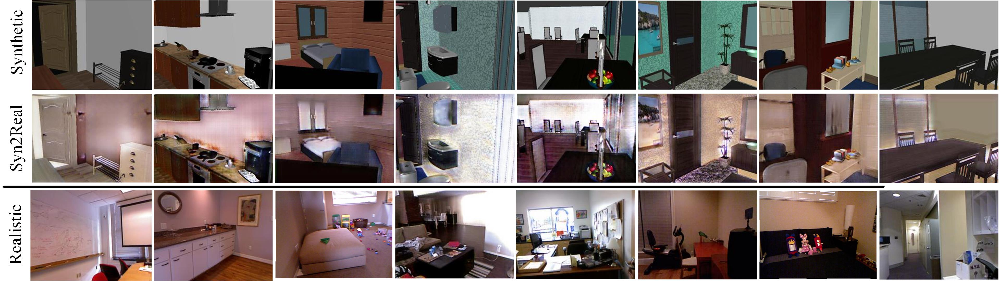
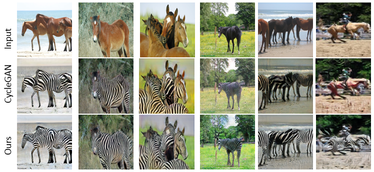

# Synthetic2Realistic
This repository implements the training and testing of T2Net for "[T2Net: Synthetic-to-Realistic Translation for Depth Estimation Tasks](https://arxiv.org/abs/1808.01454)" by Chuanxia Zheng, [Tat-Jen Cham](http://www.ntu.edu.sg/home/astjcham/) and [Jianfei Cai](http://www.ntu.edu.sg/home/asjfcai/) at NTU. A video is available on [YouTube](https://youtu.be/B6lOToIk0xY). The repository offers the implementation of the paper in Pytoch.

- Outdoor Translation


- Indoor Translation



- Extension (WS-GAN, unpaired Image-to-Image Translation, horse2zebra)



This repository can be used for training and testing of
- Unpaired image-to-image Translation
- Single depth Estimation

# Getting Started
## Installation
This code was tested with Pytoch 0.4.0, CUDA 8.0, Python 3.6 and Ubuntu 16.04
- Install Pytoch 0.4, torchvision, and other dependencies from [http://pytorch.org](http://pytorch.org)
- Install python libraries [visdom](https://github.com/facebookresearch/visdom) and [dominate](https://github.com/Knio/dominate) for visualization

```
pip install visdom dominate
```
- Clone this repo:

```
git clone https://github.com/lyndonzheng/Synthetic2Realistic
cd Synthetic2Realistic
```

## Datasets
The indoor Synthetic Dataset renders from [SUNCG](http://suncg.cs.princeton.edu/) and indoor Realistic Dataset comes from [NYUv2](https://cs.nyu.edu/~silberman/datasets/nyu_depth_v2.html).
The outdooe Synthetic Dataset is [vKITTI](http://www.europe.naverlabs.com/Research/Computer-Vision/Proxy-Virtual-Worlds) and outdoor Realistic dataset is [KITTI](http://www.cvlibs.net/datasets/kitti/)

## Training
**Warning: The input sizes need to be muliples of 64. The feature GAN model needs to be change for different scale**

- Train a model with multi-domain datasets:

```
python train.py --name Outdoor_nyu_wsupervised --model wsupervised
--img_source_file /dataset/Image2Depth31_KITTI/trainA_SYN.txt
--img_target_file /dataset/Image2Depth31_KITTI/trainA.txt
--lab_source_file /dataset/Image2Depth31_KITTI/trainB_SYN.txt
--lab_target_file /dataset/Image2Depth31_KITTI/trainB.txt
--shuffle --flip --rotation
```

- To view training results and loss plots, run python -m visdom.server and copy the URL [http://localhost:8097](http://localhost:8097).
- Training results will be saved under the *checkpoints* folder. The more training options can be found in *options*.

## Testing
- Test the model

```
python test.py --name Outdoor_nyu_wsupervised --model test
--img_source_file /dataset/Image2Depth31_KITTI/testA_SYN80
--img_target_file /dataset/Image2Depth31_KITTI/testA
```

## Estimation
- Depth Estimation, the code based on [monodepth](https://github.com/mrharicot/monodepth)
```
python evaluation.py --split eigen --file_path ./datasplit/
--gt_path ''your path''/KITTI/raw_data_KITTI/
--predicted_depth_path ''your path''/result/KITTI/predicted_depth_vk
--garg_crop
```

## Trained Models

The pretrained model for [indoor scene weakly wsupervised](https://drive.google.com/drive/folders/197clhZvX8zHQxZXkkBasrx4SUKyUzscT?usp=sharing).

The pretrained model for [outdoor scene weakly wsupervised](https://drive.google.com/open?id=1jHrIPP1PsVl6P5zJpZ5VQZB07YHdW-cT)

Note: Since our orginal model in the paper trained on single-GPU, this pretrained model is for multi-GPU version.

## Citation
If you use this code for your research, please cite our papers.
```
@inproceedings{zheng2018t2net,
  title={T2Net: Synthetic-to-Realistic Translation for Solving Single-Image Depth Estimation Tasks},
  author={Zheng, Chuanxia and Cham, Tat-Jen and Cai, Jianfei},
  booktitle={Proceedings of the European Conference on Computer Vision (ECCV)},
  pages={767--783},
  year={2018}
}

```

# Acknowledgments
Code is inspired by [Pytorch-CycleGAN](https://github.com/junyanz/pytorch-CycleGAN-and-pix2pix)
